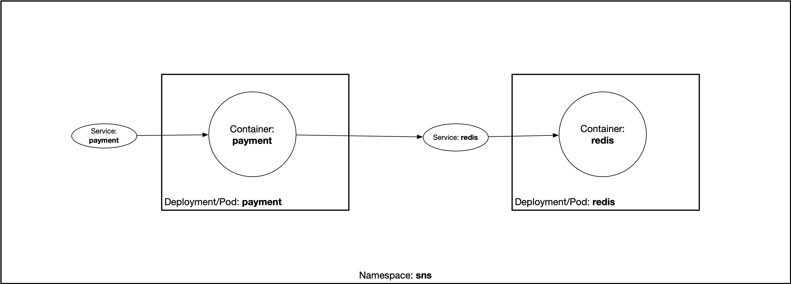

# Creating and Managing Cloud Native Services in Kubernetes

Welcome to the "Creating and Managing Cloud Native Services in Kubernetes" liveProject. This full content for this liveProject can be found here: [Creating and Managing Cloud Native Services in Kubernetes](https://www.manning.com/liveproject/creating-and-managing-cloud-native-services-in-kubernetes)

## Starting Point

The master branch is the starting point for the liveProject.

## Project Layout

* api - API Documentation for the SecurityNewsSource services using Swagger.
* api/postman - Postman tests for APIs.
* k8s - Kubernetes YAML files and other related Kubernetes resources for the SecurityNewsSource services and deployment.
* payments - The source for the `payment` service. This includes the Dockerfile and related files.
* subscriptions - This is where the source for the `subscription` service will be. This includes the Dockerfile and related files.

Directories for additional services should be added to this top-level directory. Additional Kubernetes YAML files should
be added to the `k8s/manifests` directory. Additional Kubernetes files that are not YAML manifests can be added anywhere
in the `k8s` directory.

## Starting Point Diagram

# Additional Notes 

## Milestone 2 - Starting Point

For those learners who may be unfamiliar with Javascript and Node.js, there is a provided starting point that will provide the base service implementation along with comments for where implementation from the learner should be added. This is an optional starting point.

This starting point can be found on the branch `milestone2/base`: https://github.com/robpacheco/cloud-native-kubernetes-liveproject/tree/milestone2/base

